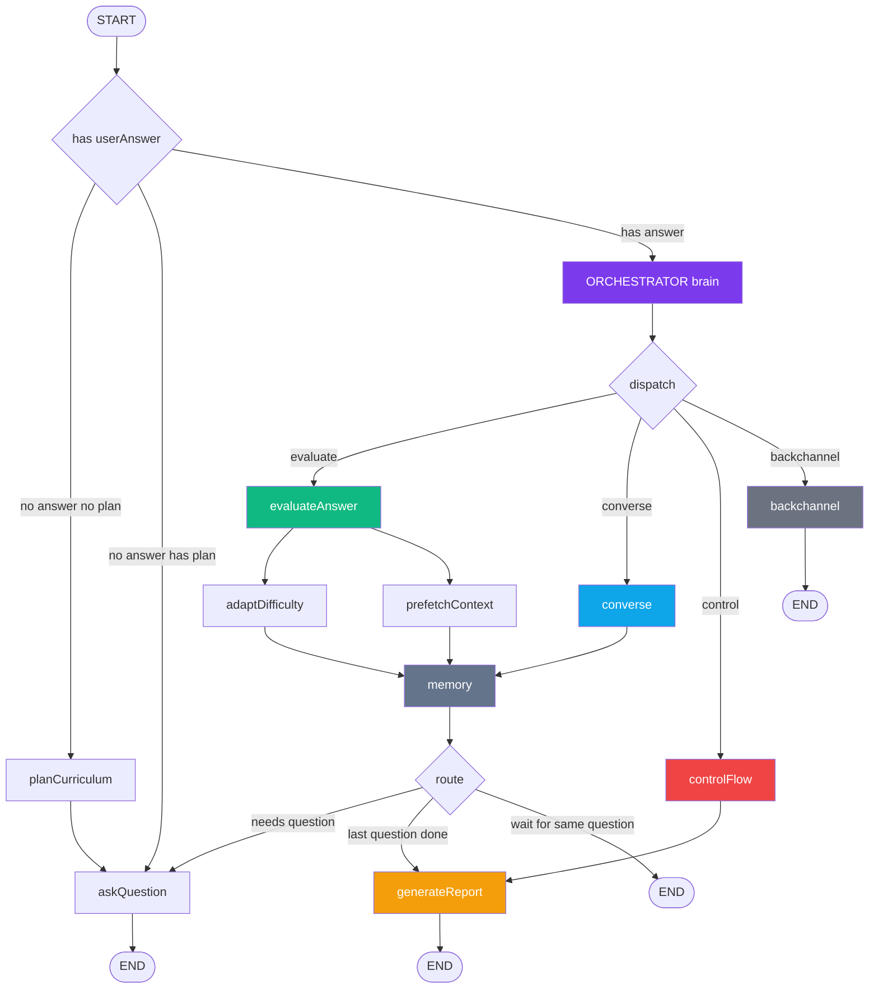
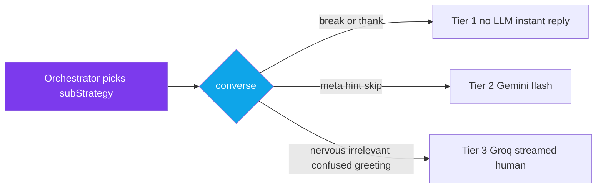

# Deep Interview Agent — Intelligent Orchestrator Architecture

A complete redesign of the interview agent as a **deep agent**: an intelligent LLM **orchestrator** sits at the centre and, on every candidate turn, *reasons* about the whole situation and *decides* which specialized sub-agent to dispatch to — exactly like a real human interviewer deciding "is this an answer, or do I need to handle something else?"

This replaces the old regex `routerNode → handleEdgeCase` God-Node pattern with a thinking brain + clean specialists.

---

## Why a new agent (not a patch)

The old agent was a fixed state machine: regex decides intent, a 240-line God Node hardcodes 9 robotic responses. It can't adapt to undeterministic real-interview situations. A candidate going off-topic gets "Let's stay on topic." A nervous candidate gets a cached phrase.

The deep agent **reasons every turn**:
- It reads the question, what the candidate actually said, their mood, the pattern of recent behaviour, their scores, the acoustics (paused? rushed? interrupted?).
- It decides the right move and gives the chosen specialist a one-line **directive** on tone and content.
- The specialists respond like a human — acknowledge, adapt, bridge back, keep the interview focused.

---

## Architecture (diagram)



**converse sub-strategies (orchestrator picks one):**



---

## Architecture (ASCII)

```
                          ┌──────────────────────────┐
   candidate speaks  ───▶ │   ORCHESTRATOR (brain)   │  LLM reasons over full context
                          │  decides dispatch + gives │  → {dispatch, subStrategy,
                          │  a directive to the sub   │     directive, followWithQuestion,
                          └────────────┬─────────────┘     mood}
              ┌────────────────────────┼────────────────────────┬──────────────┐
              ▼                        ▼                        ▼              ▼
       ┌────────────┐          ┌──────────────┐        ┌──────────────┐  ┌────────────┐
       │ evaluate   │          │   converse   │        │ controlFlow  │  │ backchannel│
       │ Answer     │          │  (human      │        │ (stop/unwell │  │ (thinking/ │
       │ (grade)    │          │   moments)   │        │  → end)      │  │  cutoff)   │
       └─────┬──────┘          └──────┬───────┘        └──────┬───────┘  └─────┬──────┘
             │ parallel               │                        │                │
     ┌───────┴───────┐                │                        ▼                ▼
     ▼               ▼                ▼                  generateReport         END
 adaptDifficulty  prefetchContext   memory  ◀── (consolidate: summary,
     └───────┬───────┘   │           │            trim history, pattern)
             ▼           ▼           │
            memory ◀─────┘           │
             │                       │
             ▼                       ▼
         afterMemory ──────▶ askQuestion ──▶ END
             │
             └──▶ generateReport ──▶ END   (when last question answered)
```

**Entry (first turns):** `planCurriculum → askQuestion → END`, then `askQuestion → END` for subsequent first-questions, exactly as before.

---

## The Orchestrator (the brain)

**Model:** Groq `llama-3.3-70b` @ temp 0, 160 tokens, **1.8s timeout → heuristic fallback.**
Two ultra-fast no-LLM shortcuts first (pure filler → backchannel; explicit "stop" → control) for latency.

**Reads:** currentQuestion, userAnswer, Q-progress, avg score, struggleStreak, mood, conversationPattern, hintsGiven, offTopicCount, acoustic signals, last 2 turns.

**Outputs JSON:**
```json
{
  "dispatch": "evaluate | converse | control | backchannel",
  "subStrategy": "encourage_nervous | redirect_focus | answer_meta | give_hint | acknowledge_break | warm_greeting | thank | rephrase_confused | skip_question | stop | unwell",
  "followWithQuestion": true,
  "directive": "one sentence telling the specialist HOW to respond",
  "mood": "neutral | nervous | frustrated | engaged | lost | confident"
}
```

**Key decision rule (in the prompt):**
- `evaluate` — a genuine attempt to answer (even partial/wrong/rambling). Default for real attempts.
- `converse` — not an answer but a human moment (nervous, off-topic, meta question, hint, break, greeting, thanks, confused, skip).
- `control` — wants to end, or unwell.
- `backchannel` — still thinking / cut off → tiny ack, wait.

`followWithQuestion`: should we move to a NEW question after handling (e.g. skip = yes), or answer and WAIT on the same question (meta/hint/nervous/confused = no)?

If the LLM fails/times out → heuristic: ≥5 words → evaluate, else converse/redirect. Never crashes.

---

## The Sub-Agents (specialists)

### `converse` — human-moment handler (replaces the God Node)
Three tiers driven by the orchestrator's `subStrategy` + `directive`:

| Tier | subStrategy | Behaviour |
|---|---|---|
| 1 (no LLM) | `acknowledge_break`, `thank` | Instant warm fixed responses |
| 2 (Gemini flash-lite) | `answer_meta`, `give_hint`, `skip_question` | Uses exact numbers / RAG context |
| 3 (Groq 70b, streamed) | `encourage_nervous`, `redirect_focus`, `rephrase_confused`, `warm_greeting` | Full context, human-like |

- **nervous** → references their *actual* past scores: "You scored 8 on the last one — just talk me through this."
- **irrelevant** → acknowledges the *specific* thing they said + bridges back. Never "stay on topic." AI-identity questions get an instant witty fast-path. 3rd+ off-topic escalates firmly.
- **meta** → real numbers, warm: "2 left, averaging 7/10 — going great!"
- **confused** → rephrases the *same* question more simply (updates `currentQuestion`).
- **hint** → RAG-powered, progressive (max 2, hint 2 more specific).

### `evaluateAnswer`, `askQuestion`, `planCurriculum`, `generateReport`, `backchannel`, `adaptDifficulty`, `prefetchContext`, `memory`
**Reused unchanged** from the existing agent (`gradeAnswerNode`, `generateQuestionNode`, `planCurriculumNode`, `generateFinalReportNode`, `backchannelNode`, `adaptDifficultyNode`, `prefetchContextNode`, `updateSummaryNode`). The grading rubric, acoustic context, follow-up system, curriculum planning, and RAG prefetch are all preserved — they're the proven parts.

`memory` (= `updateSummaryNode`) is the single consolidation point both paths flow through: rebuilds the score summary, trims chat history.

---

## Models (LLMs)

Two models do all the work — a **reasoning** model and a **fast-formatting** model.

| Role | Model ID | Where it runs |
|---|---|---|
| **Reasoning / generation** | Groq `llama-3.3-70b-versatile` (primary)<br/>`meta-llama/llama-3.3-70b-instruct` (fallback) | orchestrator, grading, question generation, rich human responses |
| **Fast formatting** | Google `gemini-3.1-flash-lite` | meta answers, hints, skips, backchannel acks, semantic checks |

`makeLLM()` → Groq 70b with an automatic fallback chain (via `lib/llm.js` → `createLLMWithFallback`).
`makeGeminiMini()` / `generateBackchannel()` → Gemini Flash Lite.

### Per-node model map

| Node | Model | Temp / tokens | Why |
|---|---|---|---|
| **orchestrator** | Groq `llama-3.3-70b` | 0 / 160 | Solid reasoning + reliable JSON |
| **evaluateAnswer** (grade) | Groq `llama-3.3-70b` | 0.1 / 340 | Rubric grading |
| ↳ backchannel ack | Gemini `flash-lite` | 0.9 / 20 | Tiny "Oh nice" — fast & cheap |
| **converse** → meta / hint / skip | Gemini `flash-lite` | 0.5 / 70–100 | Just formats facts — speed wins |
| **converse** → nervous | Groq `llama-3.3-70b` | 0.7 / 90 | Warm, contextual empathy |
| **converse** → confused | Groq `llama-3.3-70b` | 0.5 / 120 | Smart rephrase |
| **converse** → greeting | Groq `llama-3.3-70b` | 0.6 / 70 | Warm redirect |
| **converse** → off-topic redirect | Groq `llama-3.3-70b` (streamed) | 0.7 / 110 | Acknowledge + bridge |
| **askQuestion** | Groq `llama-3.3-70b` | 0.7 / 120 | Question generation |
| **planCurriculum** | Groq `llama-3.3-70b` | 0.3 / 350 | Curriculum JSON |
| **generateReport** | Groq `llama-3.3-70b` | 0.3 / 400 | Final debrief |
| **controlFlow / backchannel** | none | — | Deterministic / cached |

### Why the split

```
Groq llama-3.3-70b  → "thinking" work: reason, grade, generate, empathize  (~200-300ms on LPU)
Gemini flash-lite   → "formatting" work: speak facts fast & cheap (meta, 2-word acks)
```

A 70B model is overkill for "you've answered 5 of 10" — Flash Lite handles that faster and cheaper. The 70B is reserved for anything that needs real reasoning or warmth.

### Configuration

The Gemini model is env-overridable everywhere (deep agent, backchannel, `lib/llm.js`, `transcriptCleaner.js`):

```
GEMINI_MINI_MODEL=gemini-3.1-flash-lite   # default; override with the exact id from Google AI Studio if it differs
```

The Groq model comes from `lib/llm.js` (`createLLMWithFallback`, provider `groq`). If a Gemini id is wrong, calls fail gracefully — meta/hint fall back to hardcoded templates with the real numbers, backchannel returns empty. Nothing crashes.

---

## State

`deepInterviewStateChannels` = all 32 existing channels **+ 8 new**:

```js
dispatch:            "",          // orchestrator decision
subStrategy:         "",          // fine-grained strategy
directive:           "",          // instruction to the chosen specialist (reset after use)
followWithQuestion:  false,       // converse → ask a new question or wait?
needsQuestion:       false,       // routing flag into afterMemory
interviewMood:       "neutral",   // persists across turns (tracks the arc)
turnCount:           0,
conversationPattern: [],          // append-reducer, keeps last 6 non-answer strategies
```

---

## Drop-in compatibility (zero worker/bridge changes)

The deep agent maps its decisions back to the **legacy `intent`** values the worker already understands, so `worker.js`, `sessionBridge.js`, and `routes/interview.js` need **no changes**:

| subStrategy / dispatch | legacy `intent` | worker behaviour |
|---|---|---|
| evaluate | `answer_attempt` | feedback + next question |
| encourage_nervous | `nervous` | feedback + re-ask same question |
| skip_question | `skip` | feedback + next question |
| answer_meta | `meta` | feedback only, wait |
| give_hint | `hint_request` | feedback only, wait |
| acknowledge_break | `break_request` | feedback only, wait |
| rephrase_confused | `confused` | feedback only, wait (currentQuestion updated) |
| redirect_focus | `irrelevant` | feedback only, wait |
| warm_greeting | `greeting` | feedback only, wait |
| thank | `gratitude` | feedback only, wait |
| control/stop | `stop` | outro, end |
| control/unwell | `unwell` | outro, end |
| backchannel | `thinking_out_loud` / `premature_cutoff` | tiny ack / silent |

The result object (`evaluation`, `currentQuestion`, `scores`, `topicScores`, `finalReport`, `questionsAsked`, `difficultyLevel`) is identical in shape.

---

## How to enable

New env flag in `.env`:
```
INTERVIEW_AGENT_MODE=deep      # or "classic" (default)
```
`server.js` picks the factory:
```js
const factory = process.env.INTERVIEW_AGENT_MODE === 'deep'
    ? createDeepInterviewAgent
    : createInterviewAgent;
interviewAgent = await factory();
```
Old agent stays fully intact. Flip the flag to roll back instantly.

---

## Files

| File | Change |
|---|---|
| `lib/interview/deepInterviewAgent.js` | **NEW** — orchestrator + converse + controlFlow nodes, routing, `createDeepInterviewAgent` factory |
| `lib/interview/interviewAgent.js` | One additive `export {…}` block exposing reused helpers + node functions. No behaviour change. |
| `server.js` | Env-flag factory selection (2 lines) |
| `.env` | `INTERVIEW_AGENT_MODE=deep` |

`worker.js`, `sessionBridge.js`, `routes/interview.js`, frontend — **untouched.**

---

## Verification

Run an interview with `INTERVIEW_AGENT_MODE=deep` and walk the matrix:

```
1.  Real answer           → 'Orchestrator dispatch: evaluate' → graded, next question
2.  "hmm…"                → dispatch: backchannel (no LLM) → tiny ack
3.  "stop"                → dispatch: control (no LLM) → outro + report
4.  "what's the weather"  → dispatch: converse/redirect_focus → acknowledges + bridges (NO "stay on topic")
5.  "I'm blanking"        → converse/encourage_nervous → references real past scores
6.  "how many left?"      → converse/answer_meta → "2 left, averaging X/10"
7.  "give me a hint"      → converse/give_hint → progressive RAG hint
8.  "can we pause?"       → converse/acknowledge_break → warm, waits
9.  "I don't know, pass"  → converse/skip_question → "no worries" + next question
10. "what do you mean?"   → converse/rephrase_confused → simpler re-ask
```

**Log signals:** `'Orchestrator dispatch: <x>'` every turn; `'Orchestrator fallback (heuristic)'` must never 500; `grep "stay on topic"` → zero.

**Regression:** classic mode (`INTERVIEW_AGENT_MODE=classic` or unset) is byte-identical to today.
